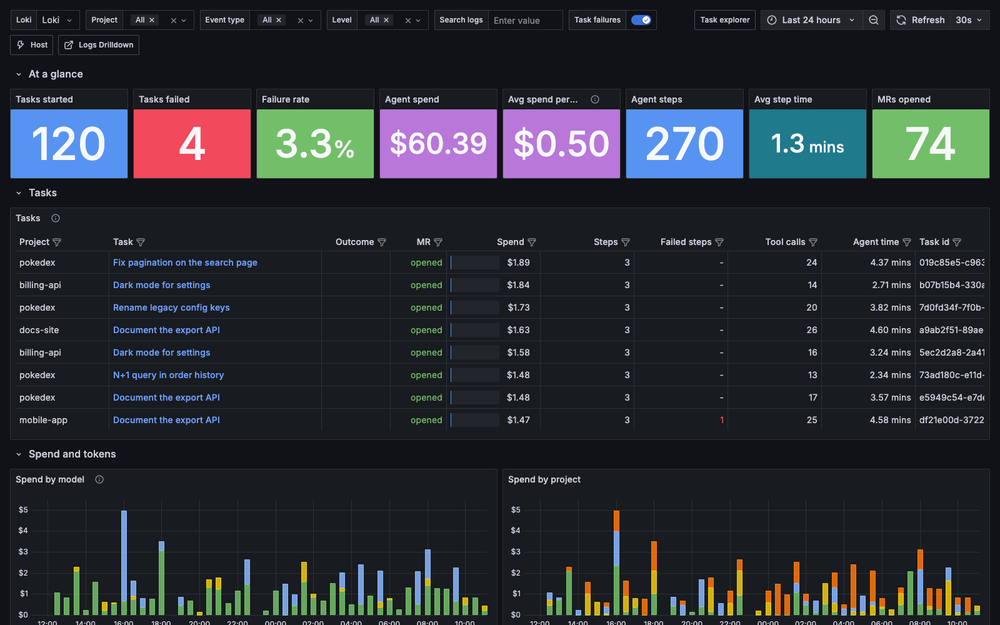
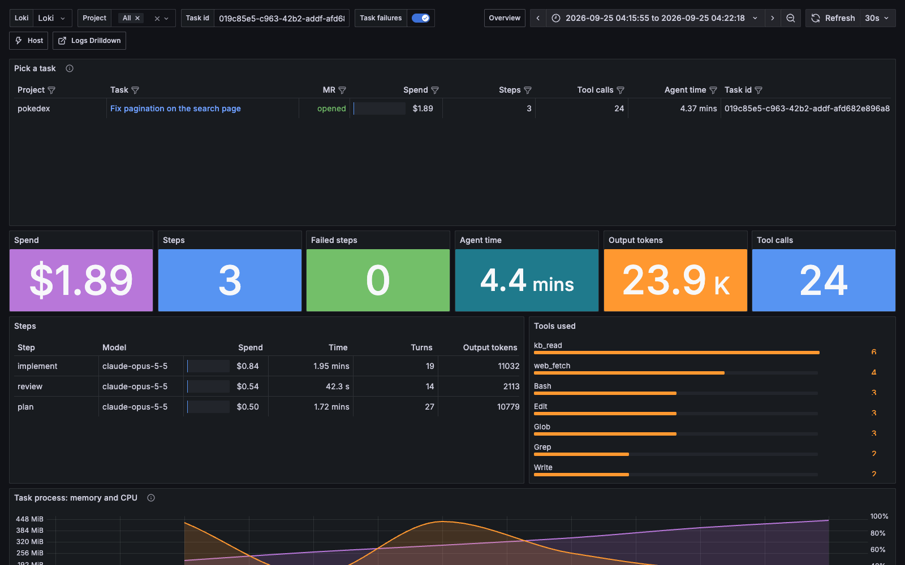
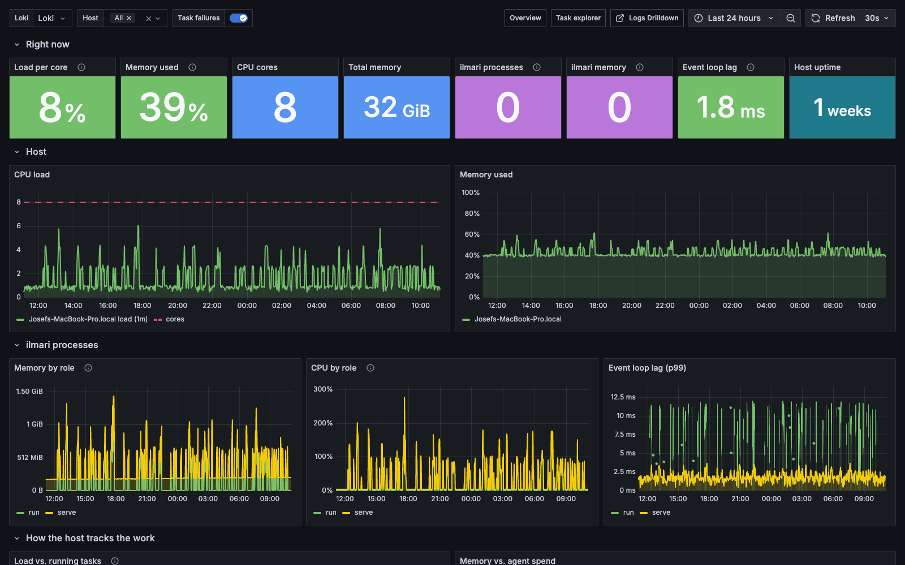

# ilmari-plugin-loki

An [ilmari](https://ilmari.dev) log sink that pushes every task event (the same
progress log the web monitor shows) to [Grafana Loki](https://grafana.com/oss/loki/).
The plugin also samples the host and its own ilmari processes once a minute, and
ships three ready-made Grafana dashboards: Overview, Task explorer and Host.



Plain ESM, zero dependencies. Requires an ilmari version whose `LogSink.handle`
receives `ctx.pluginConfig` (the sink context).

## Install

```sh
ilmari plugin add https://github.com/wraithyy/ilmari-plugin-loki.git
# or from a local checkout
ilmari plugin add /path/to/ilmari-plugin-loki/dist/index.js
```

When prompted, approve the `net` capability (pushing to Loki) and the `secrets`
capability (the encrypted password or token).

## Configure

Set the fields in the plugin settings in the console. On a headless daemon, use
the env fallbacks instead. The plugin does nothing until `url` is set.

| Field | Env | Meaning |
|---|---|---|
| `url` | `LOKI_URL` | Loki base address, e.g. `http://loki:3100` |
| `username` | `LOKI_USERNAME` | Basic auth user (a proxy in front of Loki) |
| `password` | `LOKI_PASSWORD` | Basic auth password (secret) |
| `token` | `LOKI_TOKEN` | Bearer token, used when no `username` is set (secret) |
| `tenant` | `LOKI_TENANT` | `X-Scope-OrgID` for multi-tenant Loki |
| `systemIntervalSeconds` | `LOKI_SYSTEM_INTERVAL` | How often host and process samples are sent; default `60`, `0` turns them off |

## Dashboards

`grafana/` is a complete Loki + Grafana stack with the data source and the
dashboards provisioned:

```sh
cd grafana
docker compose up -d                 # Grafana on :3000, Loki on :3100
GRAFANA_PORT=3001 docker compose up -d   # if :3000 is taken
```

Point the plugin's `url` at `http://localhost:3100`. To use an existing Grafana
instead, import the JSON files in `grafana/dashboards/`. They ask for a Loki
data source.

- **ilmari - Overview**
  - Headline numbers: tasks, failure rate, agent spend, spend per task, step time, MRs.
  - A sortable table with one row per task.
  - Spend by model and project, tokens including cache.
  - Reliability: failed steps by cause, verification, review verdicts, top tools, the costliest and slowest steps.
  - A browsable **Activity log**: one readable line per event, coloured by level, filterable by project, event type, level and free-text search, with infinite scroll.
- **ilmari - Task explorer**
  - A single task's spend, steps and tools.
  - The memory and CPU of the process that ran it.
  - Its lifecycle timeline and the full agent transcript.

  Clicking a task anywhere opens it here, zoomed to that task's own time window.
- **ilmari - Host**
  - Load per core, memory, and ilmari's processes: the daemon vs. task runs, memory, CPU and event-loop lag.
  - How the host tracks the work: load next to running tasks, memory next to agent spend.
  - The heaviest task runs.




The **Logs Drilldown** link opens Grafana's point-and-click log browser
pre-filtered to ilmari. Every log line's details include a link to its task.

### Preview with demo data

```sh
cd grafana && docker compose up -d && cd ..
LOKI_URL=http://localhost:3100 npm run demo   # one made-up day: 60 tasks + system samples
docker compose -f grafana/docker-compose.yml restart loki
```

The restart is needed because a whole day is backfilled at once. Loki only
queries its unflushed in-memory data for the last 3 hours, so the older part
shows up after the flush that a restart forces. Live ilmari data does not need
this.

## What lands in Loki

**Task events.** Each task event is one log line. Its labels are
`service_name="ilmari"`, `type` (the event type), `level` (`error`, `warn` or
`info`), `host`, and `project`. `project` is the repo name, taken from the
task's `task_created`.

The line is JSON:

```json
{"task":"<id>","type":"node_finished","project":"pokedex","workflow":"default",
 "title":"Fix pagination","data":{...the event...},"at":1790330400123}
```

The task id is deliberately not a label, since one stream per task would bloat
Loki's index. `at` repeats the timestamp as a number, so LogQL can unwrap a
task's first and last event.

**System samples.** `type="system"` events come from every ilmari process that
has the plugin loaded (`ilmari serve` and each task run), once a minute. Each
carries:

- host load and memory
- CPU count and uptime
- the process's own RSS, heap, CPU % and event-loop lag (p99)
- its role (`serve`, `run`, ...)
- the task it last handled

Sampling starts with the process's first event.

Example LogQL:

```logql
{service_name="ilmari", level="error"}                          # everything that went wrong
{service_name="ilmari"} | json | task="<task id>"               # one task
sum by (model) (sum_over_time({service_name="ilmari", type="node_finished"}
  | json v="data.costUsd", model="data.model" | unwrap v [1h]))  # spend per model
```

## Limits

- **One push per event.** There is one HTTP push per event. That's fine for
  normal task volume; batching can come later if Loki load shows it's needed.
- **Muted after a failure.** ilmari mutes a sink after its first failed
  delivery until the process restarts. If Loki is down or the credentials are
  wrong, restart ilmari after fixing it; the first error is logged. Failed
  system samples are dropped silently.
- **Project needs `task_created`.** `project` is known only for tasks whose
  `task_created` the same process saw.
- **macOS memory reads high.** On macOS, host "memory used" reads high
  because the OS counts file cache as used.

## Development

```sh
npm test                                     # fake Loki server, no network
ILMARI_SRC=/path/to/ilmari npm test          # also runs ilmari's static inspector
npm run dashboards                           # regenerate grafana/dashboards/*.json
```

The dashboards are generated by `scripts/build-dashboards.mjs`. Edit that file,
not the JSON.
